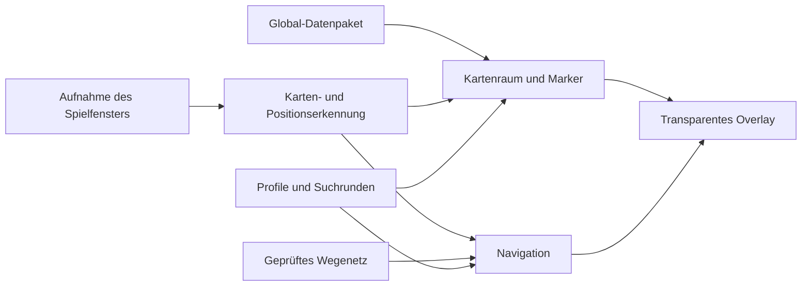

# Aion 2 Cube Overlay – Projektplan

Stand: 6. Oktober 2026. Zielplattform: Aion 2 Europa/Global, Windows, randloses Fenster. Status: Prototyp in Umsetzung. Aufnahme, sichtbarer Rahmen und erster erfolgreicher automatischer Kartenabgleich sind vom Nutzer bestätigt; ein Screenshot v0.3.1 zeigt die gespeicherte Zuordnung. Vollständige Ingame-/Genauigkeitsabnahme und Cube-Daten stehen aus. Nachweis: [SPEC-003-Validierung](docs/validation/003-auto-map-registration.md).

Anforderungsänderung vom 6. Oktober 2026: Der Nutzer lehnt präzise Landmarkenklicks ab. Automatischer Bildabgleich wird vor die Cube-Darstellung gezogen. [SPEC-003](docs/specs/003-auto-map-registration.md) beschreibt das Soll-Verhalten, [ADR-001](docs/decisions/001-automatischer-kartenabgleich.md) die Entscheidung. v0.3.0 enthält den automatischen Prototyp einschließlich Dialog und nativer Bildanalyse; technische Prüfungen bestehen, die echte EU/Global-Kartenabnahme bleibt offen. Siehe [Validierung](docs/validation/003-auto-map-registration.md).

## 1. Ziel und erste Produktentscheidung

Eine eigenständige Windows-Anwendung legt Hidden-Cube-Markierungen deckungsgleich über die geöffnete Ingame-Karte. Ein ausgewählter Spot wird zum Navigationsziel. Anschließend zeigt ein kleines HUD seine Richtung und, sofern der Kartenmaßstab bekannt ist, seine ungefähre Entfernung zur eigenen Position.

Die erste Version konzentriert sich auf eine Global-Karte, einen unterstützten Kartenmodus und 20–30 in dieser Spielversion geprüfte Fundstellen. So lassen sich Datenqualität, Kartenabgleich und Positionserkennung prüfen, bevor viele Karten oder tausende Marker hinzukommen. Die Startkarte wird nach Fraktion und verfügbaren Prüfdaten gewählt.

**Empfehlung:** Zuerst Kartenmarker, dann Positionsanzeige, dann eine geprüfte Route auf der Karte. Eine perspektivische 3D-Spur am Boden erhält einen eigenen Machbarkeitsnachweis und ist keine Voraussetzung für die erste Version.

## 2. Was die Referenzen belegen – und was noch offen ist

| Referenz | Ergebnis | Konsequenz für das Projekt |
| --- | --- | --- |
| [Blish HUD: Funktionsweise](https://blishhud.com/docs/user/faqs/how-does-bhud-work/) | Blish HUD arbeitet als separates transparentes Fenster. GW2 liefert über MumbleLink unter anderem Spielerposition und Kameradaten. | Das Overlay-Prinzip übernehmen; eine vergleichbare Datenquelle für Aion 2 separat nachweisen. |
| [Blish HUD Pathing](https://github.com/blish-hud/Pathing) | Das offizielle Modul unterstützt Marker und Trails. | Orientierung für Datenpakete und Darstellung; keine fertige Aion-2-Integration. |
| [Questlog Aion-2-Karte](https://questlog.gg/aion-2/en/map) | Die bereitgestellte Karte dient als fachliche und visuelle Referenz. Der Suchindex beschreibt Hidden-Cube-Filter. Die dynamische Seite ließ sich im Textabruf nicht vollständig prüfen. | Export, Rohkoordinaten, Global-Abdeckung und Nutzungsbedingungen sind noch zu prüfen. Eine offene API ist nicht bestätigt. |
| [Corpus Hidden-Cube-Karte](https://corpus.gg/games/aion-2/map/hidden-cubes) | Der Anbieter beschreibt mögliche Fundstellen und Suchgruppen und kennzeichnet die Karte als Global-Referenz. | Das Modell unterstützt mehrere Kandidaten pro Gruppe. Keine Aussage über aktuell aktive Cubes ableiten; Angaben im EU/Global-Client prüfen. |
| [PLAYNC Developers](https://developers.plaync.com/) | In der Recherche wurde keine dokumentierte Aion-2-Schnittstelle für die eigene Live-Position und Kamera bestätigt. | Positionserkennung als frühe technische Untersuchung einplanen. Das ist kein Nachweis, dass eine solche Schnittstelle grundsätzlich nicht existiert. |

Die folgenden Architekturentscheidungen und Aufwandsschätzungen sind Projektvorschläge. Sie sind keine bereits getesteten Eigenschaften von Aion 2.

## 3. Funktion 1: Hidden Cube Spots auf der Ingame-Karte

### Nutzerablauf

1. Overlay starten und ein Profil für Europa/Global, Auflösung und UI-Skalierung wählen.
2. Im Spiel die unterstützte Gebietskarte öffnen.
3. Eine lokale Referenz einmal wählen; „Automatisch abgleichen“ ordnet gemeinsame Kartenmerkmale ohne Landmarkenklicks zu und prüft die Deckung. Gespeicherte Referenzen werden beim nächsten Start erneut mit einer frischen Aufnahme abgeglichen.
4. Cube-Spots erscheinen über den entsprechenden Stellen der Ingame-Karte.
5. Über einen einstellbaren Hotkey in den Auswahlmodus wechseln, einen Spot auswählen und Details öffnen.
6. Zum Spiel zurückkehren; das Ziel bleibt im HUD sichtbar.

Im normalen Betrieb gehen Mausaktionen an das Spiel. Der ausdrücklich aktivierte Auswahlmodus nimmt Klicks entgegen. Die Hotkeys sind konfigurierbar und werden auf Konflikte geprüft. Das Overlay sendet keine Bewegungs- oder Interaktionseingaben an das Spiel.

### Darstellung

| Markierung | Bedeutung |
| --- | --- |
| Kleiner Cube mit Nummer | Bekannte mögliche Fundstelle |
| Hervorgehobener Cube | Ausgewähltes Ziel |
| Gruppe mit Anzahl | Zusammengefasste Kandidaten bei kleinem Zoom |
| Gedimmter Marker | In der aktuellen Suchrunde bereits geprüft |
| Zusätzliches Wasser-/Höhensymbol | Unterwasser, andere Ebene oder bestätigter Höhenhinweis |

Unterschiede werden durch Symbole und Text kenntlich gemacht, nicht allein durch Farben. Die Detailkarte enthält Gebiet, Notiz zum Zugang, Quelle, Prüfdatum und Datenversion. „Möglicher Spot“ und „selbst gesehen“ sind getrennte Informationen.

„Hier nichts gefunden“ gilt für die aktuelle Suchrunde beziehungsweise Beobachtung. Es löscht die Fundstelle nicht dauerhaft. „Cube eingesammelt“ ist eine manuelle Bestätigung mit Zeitpunkt. Rücksetzen und Profilwechsel bleiben möglich; ein automatischer Respawn-Timer wird erst nach belegten Regeln ergänzt.

### Kartenabgleich

Fundstellen werden in einem definierten Kartenraum gespeichert. Eine Transformation bildet sie auf den sichtbaren Kartenausschnitt ab. Kartenausschnitt, Zoom, Verschiebung, gegebenenfalls Rotation, Fensterposition und Windows-DPI müssen berücksichtigt werden.

Der bisherige manuelle Prototyp bestimmt eine affine Abbildung mit drei Landmarken und zwei zusätzlichen Prüfstellen. Seine echte Kartenabnahme ist offen; er wird als Standardablauf zurückgestellt. Die neue Planung beginnt mit dem automatischen Abgleich eines eingefrorenen Bildpaares aus Referenz und aktueller Aufnahme gemäß SPEC-003. Viele gemeinsame Gelände-/Wegmerkmale, ein robustes begrenztes Modell und unabhängige Kontrolle ersetzen Handklicks.

Anschließend folgen laufendes Nachführen und die Umrechnung vom Aufnahmebild zum Overlay in einem eigenen Arbeitspaket. Nicht passende Gebiete, Kartenübergänge oder uneindeutige Treffer dürfen keine scheinbar korrekten Marker erzeugen. Kartenbereich und Bedienelemente werden getrennt maskiert. Der lokale Altgard-Ausschnitt deckt nur seinen geprüften gemeinsamen Bereich ab, nicht das gesamte Gebiet.

Das Overlay muss erkennen, ob die Karte tatsächlich offen ist. Ein mitgehörter Karten-Hotkey allein genügt nicht: Die Karte kann auch anders geöffnet werden, und ein Tastendruck kann vom Spiel ignoriert werden. Bis zur zuverlässigen Erkennung gibt es einen manuellen Anzeigeschalter.

## 4. Funktion 2: Relative Position und Navigation

### Stufe A: Richtung zum ausgewählten Spot

Die Spielerposition und das Ziel werden im gleichen Kartenraum verglichen. Das HUD zeigt Zielname, ungefähre Richtung, Positionsalter und Erkennungsqualität.

Als erste verlässliche Darstellung dient ein nach Kartennorden ausgerichteter kleiner Kompass. Ein Pfeil „links/rechts vor dir“ kommt erst hinzu, wenn die Bezugsausrichtung sicher bekannt ist. Bewegungsrichtung, Blickrichtung des Charakters und Kameraausrichtung sind unterschiedliche Größen; sie dürfen nicht austauschbar verwendet werden.

Eine Verbindungslinie auf der Karte bedeutet **Luftlinie**, nicht begehbaren Weg. Meterangaben erscheinen erst nach einer geprüften Umrechnung von Kartenkoordinaten in Spielentfernung. Bis dahin zeigt das HUD eine Kartenrichtung und gegebenenfalls eine Entfernung ohne Meterbehauptung. Höhenangaben erscheinen nur bei vorhandenen, geprüften Höheninformationen.

### Wie kommt die eigene Position ins Overlay?

| Quelle | Geplanter Einsatz | Grenze |
| --- | --- | --- |
| Dokumentierte, vom Spiel vorgesehene Telemetrie | Bevorzugter Adapter, falls vorhanden und geeignet | Für Aion 2 bislang nicht bestätigt |
| Spielericon auf geöffneter Gebietskarte | Erster automatischer Versuch; Position anhand des Kartenabgleichs bestimmen | Liefert nur bei sichtbarem Icon und passender Ansicht aktuelle Daten |
| Minimap plus Referenzkarte | Zweiter Versuch für Navigation bei geschlossener großer Karte | Rotation, Zoom, kleine Bildfläche, fehlende Merkmale und gleiche Terrainmuster können Erkennung erschweren |
| Sichtbar eingeblendete Koordinaten per OCR | Nur untersuchen, falls EU/Global solche Angaben tatsächlich zeigt | Existenz und Genauigkeit nicht bestätigt |
| Manuell gesetzter Standort | Funktionierender Rückfallmodus und Referenz für Tests | Keine kontinuierliche Live-Navigation |

Die Bildschirmverfahren sind zu erprobende Ansätze, keine zugesagte Live-Funktion. Wenn nur die große Karte funktioniert, aktualisiert sich die Position beim Öffnen der Karte. Nach dem Schließen wird die letzte Messung als veraltet markiert; daraus entsteht keine laufend aktuelle Richtungsanzeige.

Jede Messung trägt Karte, Koordinaten, Zeitpunkt, Quelle und Vertrauenswert. Ein Mapwechsel, ein unplausibler Sprung oder mehrere gleich gute Bildtreffer entwerten die Messung. Bei mehr als zwei Sekunden ohne gültige Messung wird die Live-Anzeige zunächst als veraltet markiert; dieser Startwert wird im Prototyp überprüft. Veraltete Daten werden nicht weiter als aktuelle Position geglättet oder extrapoliert.

### Stufe B: Begehbarer Pfad auf der Karte

Für eine echte Route braucht das Projekt Wegdaten. Cube-Koordinaten und ein Kartenbild liefern weder Hindernisse noch begehbare Verbindungen.

Für den ersten Routentest werden Wege in einem kleinen Gebiet manuell geprüft und als Graph gespeichert. Kanten enthalten Bewegungsart, Richtung, Kosten und Bedingungen: laufen, schwimmen, springen, fliegen oder teleportieren. Nicht verfügbare Bewegungsarten und nicht freigeschaltete Übergänge werden ausgeschlossen.

A* beziehungsweise Dijkstra sucht darin eine Route. Dijkstra ist der einfache Ausgangspunkt; eine A*-Heuristik muss auch bei Teleportkanten zulässig bleiben. Start- und Zielanschlüsse benötigen geprüfte Verbindungen: Der geometrisch nächste Knoten kann hinter einer Wand oder auf einer anderen Ebene liegen.

Die Route erscheint als Linie auf der geöffneten Karte und als nächster Wegpunkt im HUD. Ohne gültigen Weg zeigt die App „Keine geprüfte Route“ und bietet die Luftlinienrichtung an. Eine Suche nach mehreren Kandidaten einer Cube-Gruppe kann später eine Besuchsfolge erzeugen; deren Laufkosten kommen aus dem Wegenetz.

### Stufe C: 3D-Spur in der Spielwelt

Eine am Boden liegende Spur wie bei GW2 benötigt zusätzliche Informationen: Weltkoordinaten, Höhe, Kameraposition, Blickrichtung, Projektion beziehungsweise Sichtfeld sowie geeignete Weg- oder Geländedaten. Ohne Tiefeninformationen kann eine extern gezeichnete Spur zudem durch Wände sichtbar sein.

Diese Stufe startet erst, wenn eine belastbare Datenquelle und ein erfolgreicher Projektionsversuch existieren. Reine Bildauswertung der Minimap reicht dafür nicht aus. Der Aufwand ist vor diesem Nachweis nicht seriös bezifferbar.

## 5. Technischer Vorschlag

**C# mit .NET 10 LTS und WPF** für die erste Windows-Version. .NET 10 ist aktuell als LTS ausgewiesen; siehe [Microsoft Support Policy](https://dotnet.microsoft.com/en-us/platform/support/policy). WPF ist eine Projektentscheidung für Einstellungen, transparente Fenster und den überschaubaren 2D-Prototyp. Bei gemessenen Renderingproblemen kann der Zeichenadapter später ausgetauscht werden.

Bildaufnahme über **Windows.Graphics.Capture**, Bildabgleich zunächst mit OpenCV über einen gepflegten .NET-Wrapper. Microsoft dokumentiert Fenster-/Bildschirmaufnahme und ein [WPF-Beispiel](https://github.com/microsoft/Windows.UI.Composition-Win32-Samples/tree/master/dotnet/WPF/ScreenCapture); die Aufnahme des konkreten Aion-2-Fensters muss trotzdem praktisch geprüft werden. Verarbeitung läuft getrennt vom UI-Thread. [Microsoft: Screen capture](https://learn.microsoft.com/en-us/windows/apps/develop/media-authoring-processing/screen-capture).

Das Aufnahmebild soll ausschließlich das Spielfenster enthalten. Ein Vergleichstest muss ausschließen, dass eigene Marker in die Erkennung zurücklaufen. Prototypaufnahmen werden lokal nur für die Prüfung gespeichert; die normale Verarbeitung arbeitet im Speicher.

| Baustein | Aufgabe |
| --- | --- |
| OverlayHost | Spielfenster verfolgen, DPI, Sichtbarkeit, Fokus und Eingabemodus verwalten |
| CaptureService | Bildaufnahme, Größenänderungen und Ausfälle behandeln |
| MapRegistration | Gebiet und Ansicht erkennen; Transformation mit Qualitätswert liefern |
| PositionProvider | Austauschbare Positionsquellen; veraltete oder falsche Messungen abweisen |
| CubeRepository | Datenpakete validieren, nach Gebiet/Version filtern und räumlich suchen |
| NavigationService | Luftlinie, Zielauswahl und später Graphnavigation berechnen |
| ProfileStore | Kalibrierungen, Hotkeys, Suchrunden und manuelle Beobachtungen speichern |
| ReplayHarness | Dieselben Erkennungsverfahren auf gespeicherten Prüfbildern ausführen |

Zum Start genügen versionierte JSON-Dateien für Datenpakete und lokale Profile. Eine Datenbank, ein Server und Nutzerkonten sind für die erste Version nicht erforderlich.

## 6. Datenmodell und Datenbeschaffung

| Datensatz | Benötigte Felder |
| --- | --- |
| Kartenpaket | Schema-Version, Region, Spielbuild oder geprüfter Versionsbereich, Karten-ID, Achsenrichtung, Koordinatenraum, Referenz/Referenzrechte, optionale Einheitenumrechnung |
| Cube-Spot | Stabile ID, Karten-ID, Position, optionale Höhe/Ebene, optionale Suchgruppen-ID, Zugangsnotiz, Quelle, Prüfdatum, Prüfstatus |
| Positionsmessung | Karten-ID, Position, optionale Ausrichtung mit eindeutigem Bezug, Zeitpunkt, Quelle, Qualitätswert |
| Beobachtung | Profil, Suchrunde, Spot-ID, Status, Zeitpunkt und optional Kanal/Instanz |
| Weggraph | Knoten mit Ebene/Position, gerichtete Verbindungen, Kosten, Bewegungsart und Voraussetzungen |

Die ersten 20–30 Spots werden selbst im Zielclient überprüft oder aus ausdrücklich nutzbaren Daten übernommen und anschließend geprüft. Questlog wird auf einen vorgesehenen Export beziehungsweise eine Kooperation untersucht. Bis dahin plant das Projekt keine Abhängigkeit von dessen internen Endpunkten und keine Weiterverteilung fremder Kartengrafiken.

Die Zuordnung von Quellkoordinaten zur Ingame-Karte wird anhand mehrerer Landmarken geprüft. Global-, Korea- und Taiwan-Daten werden nicht stillschweigend vermischt. Ein Datenpaket darf nicht allein wegen einer ähnlichen Gebietsbezeichnung in einer anderen Version geladen werden.

## 7. Umsetzungsphasen und Aufwand

Geänderte Reihenfolge: automatischer Abgleich vor Cube-Markern. Die früheren Gesamtwerte von 6–10 / 13–22 / 21–35 Arbeitstagen setzten einen manuell kalibrierten Cube-MVP voraus und gelten nicht als Schätzung der neuen Anforderung. Aufwand für den Bildabgleich wird nach Paket A aus SPEC-003 neu geschätzt; Zeitangaben für nachfolgende Funktionen sind unveränderte, ungeprüfte Orientierungswerte für eine erfahrene Person. Zugang zum Zielclient und geeignete Prüfdaten sind erforderlich.

| Phase | Aufwand | Konkretes Ergebnis und Abschlusskriterium |
| --- | --- | --- |
| 0: Aufnahme und Overlay | Bisherige Schätzung 2–4 Tage; keine Restaufwandsschätzung | Aufnahme/Rahmen vom Nutzer bestätigt; übrige Fenster-/DPI-/Eingabeprüfung offen |
| 0a: Automatisches Bildpaar | Nach Machbarkeitsversuch schätzen | SPEC-003 A: beide Originalbilder ohne Punktwahl zuordnen, unabhängige Genauigkeit und Negativfälle prüfen; B: einfachen Dialog integrieren |
| 0b: Live-Kartenabgleich und Overlay-Geometrie | Nach 0a schätzen | Eigenes Spec-Arbeitspaket: Karte offen/geschlossen, Zoom/Pan, Alter und Aufnahme-zu-Client-Geometrie geprüft; ungültige Zuordnungen ausblenden |
| 1: Cube-MVP | Orientierung 4–6 Tage, Voraussetzung 0a/0b erfüllt | Eine Karte, 20–30 geprüfte Spots, Filter, Details, Auswahlmodus und gespeicherte Suchrunde; automatische Zuordnung |
| 2: Weitere Karten und Ansichten | Neu zu schätzen | Geprüften automatischen Abgleich über das Pilotprofil hinaus erweitern |
| 3: Richtungs-HUD | 4–7 Tage | Zielauswahl plus gemessene Position mit Qualitäts-/Altersanzeige; geschlossene Karte nur dann unterstützt, wenn Minimap-Erkennung den Test besteht |
| 4: Kartenroute im Pilotgebiet | 5–8 Tage | Geprüfter kleiner Weggraph, Routenberechnung, Wegpunkte und verständliche Behandlung unerreichbarer Ziele |
| 5: Stabilisierung | 3–5 Tage | DPI-/Fenster-/Fokustests, längere Testsitzung, Fehlerprotokoll und lokal startbares Paket |

Eine neue Gesamtspanne wird erst nach dem automatischen Pilotabgleich erstellt. Flächendeckende Wege, sämtliche Cube-Spots und 3D-Navigation sind weiterhin nicht im Pilotumfang enthalten.

### Entscheidungspunkte

- Nach Phase 0: Unterstützt der Zielclient Aufnahme und Overlay? Falls nicht, bleibt zunächst eine separate Begleitkarte als alternative Produktentscheidung.
- Nach Phase 0a: Stimmen automatische Zuordnung und unabhängige Kontrollwerte auf echten Originalen? Ohne diesen Nachweis keine Live-Marker. Bei Scheitern Ursache dokumentieren und den Ansatz überarbeiten, keine Pflicht zu manuellen Landmarkenklicks.
- Nach Phase 0b: Sind Ansichtsgültigkeit und Aufnahme-zu-Overlay-Geometrie belegt? Erst dann Cube-Spots im Spiel darstellen.
- Nach Phase 1: Stimmen Daten und Kalibrierung? Erst danach den Datensatz vergrößern.
- Nach Phase 3: Funktioniert eine aktuelle Position bei geschlossener Karte? Falls nicht, wird die Version ausdrücklich als Navigation bei geöffneter Karte angeboten.
- Vor Phase 4: Gibt es einen geprüften Graphen? Ohne ihn bleibt die Verbindung eine Luftlinie.
- Vor Stufe C: Sind Welt- und Kameradaten nachgewiesen? Ohne sie bleibt die 3D-Spur außerhalb des verbindlichen Umfangs.

## 8. Prüfplan und messbare Ziele

Die folgenden Werte sind anfängliche Zielwerte, keine bisherigen Messergebnisse. Vor den Messungen werden Testgerät, Spielbuild, Auflösung und UI-Skalierung festgehalten.

| Prüfung | Geplante Abnahme |
| --- | --- |
| Markerposition | An mindestens 20 unabhängigen Referenzpunkten je unterstütztem Profil: 95. Perzentil höchstens 8 Bildpixel Fehler bei 1080p; entsprechend skalierter Wert bei anderen Auflösungen |
| Eigene Position | Auf einem zurückgehaltenen Bildsatz mit manuell markierter Wahrheit: bei sichtbarem, eindeutigem Icon mindestens 95 % gültige Treffer innerhalb derselben Fehlertoleranz; Fehlzuordnungen separat ausweisen |
| Kartenwechsel und Unklarheit | Definierte Wechsel-, Lade- und Störbildtests liefern keine fortgesetzten Marker auf der falschen Karte; unsichere Treffer führen zum Ausblenden |
| Aktualität | Für den freigegebenen Live-Modus 95. Perzentil unter 500 ms von Aufnahme bis HUD; bei Messausfall sichtbar veraltet |
| Fenster und Eingabe | Randlos, Alt-Tab, Verschieben und unterschiedliche DPI: Marker bleiben passend; normaler Modus blockiert Spielklicks nicht; Auswahlmodus ist zuverlässig beendbar |
| Routen | Jede angebotene Pilotroute wird im Spiel abgelaufen; Einbahnübergänge, gesperrte Kanten, Wasser und Ebenen werden geprüft |
| Stabilität | Mindestens eine zweistündige Sitzung ohne Absturz oder fortlaufend wachsenden Speicherverbrauch |
| Leistung | Anfangsbudget: etwa 5–10 Erkennungsschritte pro Sekunde, unter 300 MB RAM und höchstens 5 % CPU im Mittel auf dem dokumentierten Testgerät; zusätzlich Spiel-Frametimes mit/ohne Overlay vergleichen |

Geometrie, ungültige Messungen und Graphsuche erhalten gezielte automatisierte Tests. Erkennung wird über lokal gespeicherte Prüfbilder wiederholbar getestet; ein Teil der Bilder bleibt für die abschließende Prüfung zurückgehalten. Die Aufnahme funktioniert nicht automatisch zuverlässig, nur weil die Windows-API sie grundsätzlich anbietet.

## 9. Wesentliche Risiken und Umgang damit

| Risiko | Geplante Reaktion |
| --- | --- |
| Kein belastbares Live-Tracking | Früher Nachweis; manuell oder über geöffnete Karte starten; veraltete Position kennzeichnen |
| Falsche oder versionsfremde Cube-Daten | Kleine geprüfte Stichprobe, Herkunft und Versionskennzeichnung pro Paket |
| Mehrere Kandidaten, Cube aktuell nicht vorhanden | Mögliche Spots anzeigen; Beobachtungen pro Suchrunde speichern |
| Ähnliche Kartenbilder oder verdeckte Spielericons | Vertrauensgrenze, Plausibilitätsprüfung und Ausblenden statt ungesicherter Treffer |
| Fehlende Weg-/Höhendaten | Luftlinie klar benennen; Pilotgraph prüfen; keine erfundene 3D-Route |
| Aufnahme oder Overlay durch Client eingeschränkt | Im Zielclient früh testen; separate Begleitkarte als Rückfallprodukt |
| Änderungen an UI, Spiel oder Referenzdaten | Profile und Datenpakete versionieren; nach Updates neu prüfen |

Der technische Ansatz verwendet ein separates Fenster, dokumentierte Windows-Aufnahme und bekannte Fundstellen. Prozessspeicherzugriffe, DLL-Injektion, Paketabgriff und Umgehung von Schutzmaßnahmen gehören nicht zur geplanten Architektur. Die [Global-Betriebsrichtlinie](https://www.plaync.com/policy/operation/aion2global/en) behandelt unerlaubte Programme und Clientmanipulation; eine ausdrückliche Freigabe dieses konkreten Overlay-Ansatzes wurde nicht festgestellt. Die Regeln der Zielregion und die praktische Verträglichkeit werden in Phase 0 geprüft. Der externe Ansatz allein ist keine Zusage einer Freigabe.

## 10. Erstes umsetzbares Arbeitspaket

Fortschritt vom 6. Oktober 2026: Schritt 1 ist implementiert und an einem normalen Windows-Testfenster technisch geprüft. Der Nutzer bestätigt Aufnahme und sichtbare Umrandung im Zielclient; die übrige manuelle Abnahme bleibt offen. Siehe [SPEC-001](docs/specs/001-overlay-capture.md) und [Prüfergebnis](docs/validation/001-overlay-capture.md). Der bisherige manuelle Altgard-Versuch erfüllt die Prüftoleranz nicht; [SPEC-002](docs/specs/002-map-calibration.md) bleibt als Entwicklungsdiagnose erhalten. Im Standardablauf ersetzt v0.3.0 ihn durch den automatischen Dialog aus SPEC-003. Bildanalyse und normaler WGC→Dialog-Ablauf sind technisch geprüft; unabhängige echte Kartenbilder und weitere Fehlerszenarien fehlen noch. Siehe [SPEC-003-Validierung](docs/validation/003-auto-map-registration.md). Schritte 3–6 sind noch nicht implementiert.

Ein **vertikaler Prototyp** für eine Global-Karte und ein Bildschirmprofil:

1. Spielfenster aufnehmen und ein transparentes Overlay passend darüber positionieren.
2. Beide Kartenbilder automatisch abgleichen und unabhängig prüfen (SPEC-003); anschließend Live-Gültigkeit und Aufnahme-zu-Overlay-Geometrie nachweisen.
3. Zehn geprüfte Cube-Spots laden und auf der Karte darstellen.
4. Einen Spot im Auswahlmodus als Ziel wählen.
5. Das Spielericon auf der geöffneten Karte erkennen und eine Luftlinie zum Ziel zeichnen.
6. Nach Schließen der Karte die Messung als veraltet markieren; nach erneuter Öffnung korrekt aktualisieren.

Dieses Paket beantwortet die wichtigsten Fragen vor einer größeren Implementierung: Liegt das Overlay richtig? Passen die Daten zur Global-Karte? Kann die eigene Position mit ausreichender Qualität erfasst werden? Danach folgt der Cube-MVP mit 20–30 Spots und gespeicherten Suchrunden.
